[TOC]

# lecture 2.1

## tf.where()

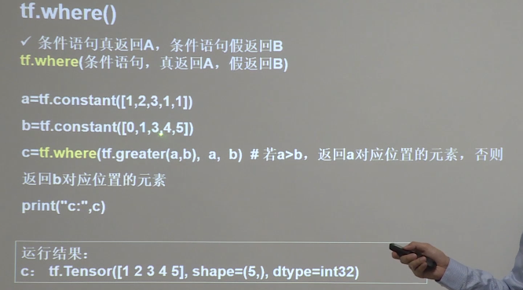

## np.random.Randomstate.rand()

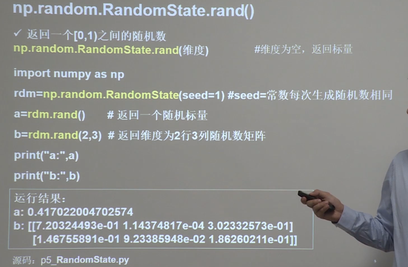

## np.vstack()

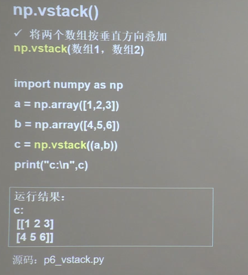

## np.mgrid[]  .ravek()	np.c_[]	网格

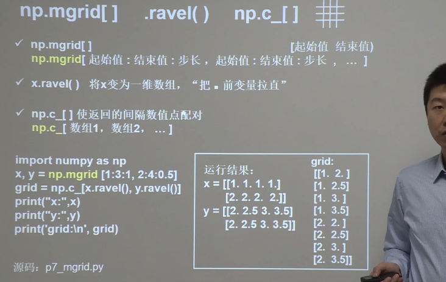

# lecture2.2

## NN复杂度

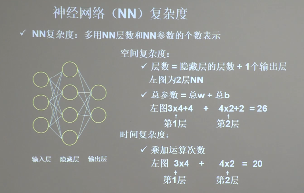

## 指数衰减学习率

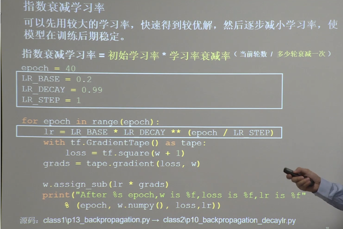

# lectuer2.3-激活函数

## sigmoid函数

**梯度消失：**

​	神经网络需要逐层链式求导，即多层导数，连续相乘，其中会有多个为0或趋于零，使得结果趋于0，导致参数无法更新。

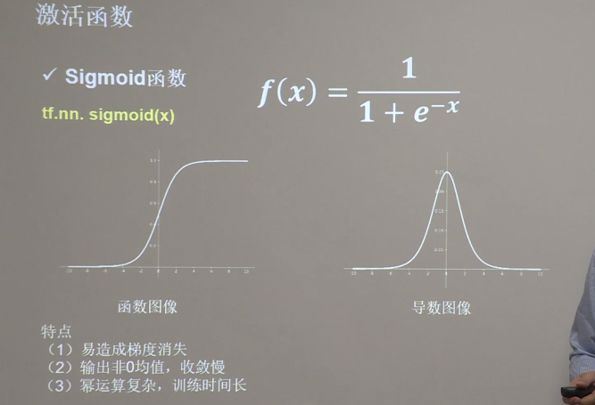

## Tanh函数

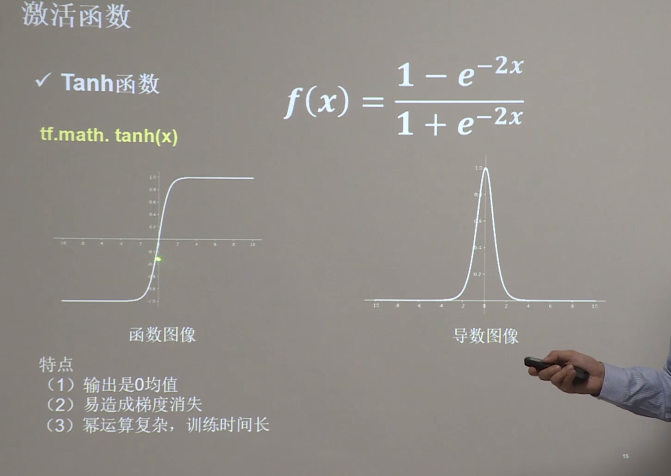

## Relu函数

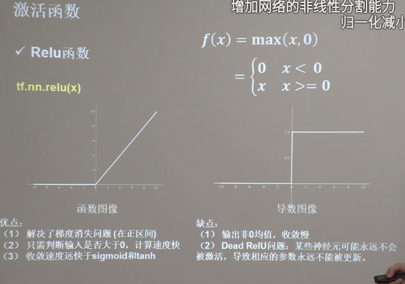

## Leaky Relu函数

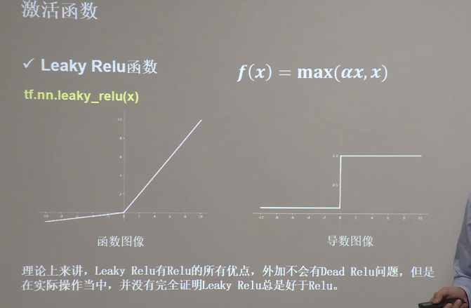

## 总结

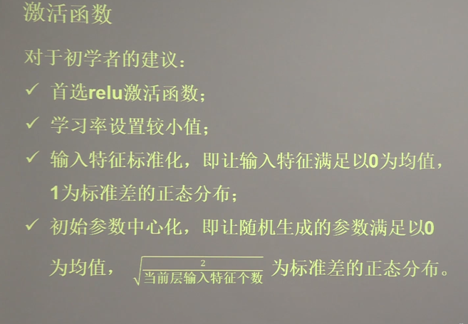

# lecture2.4-损失函数

- 均方误差
- 自定义
- 交叉熵

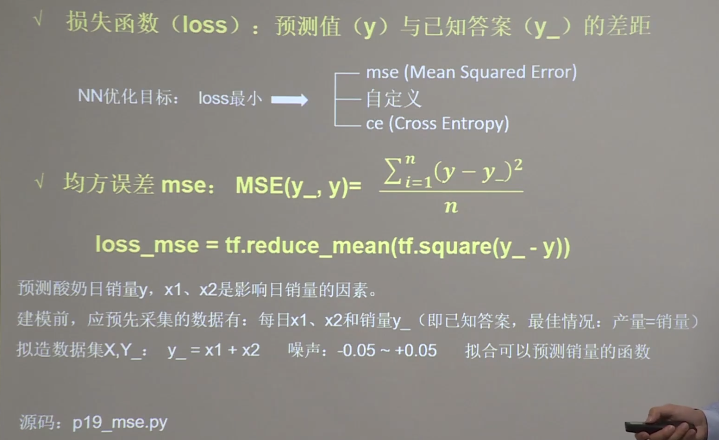

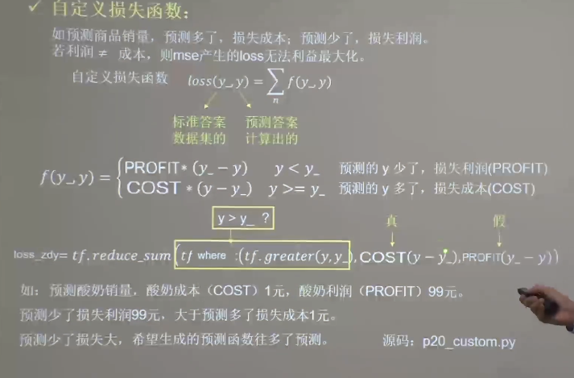

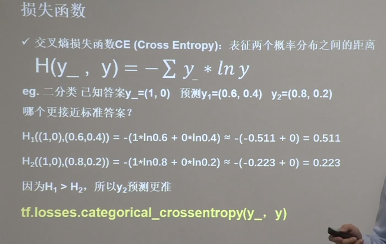

距离越近表示越接近。

### softmax和交叉熵结合使用

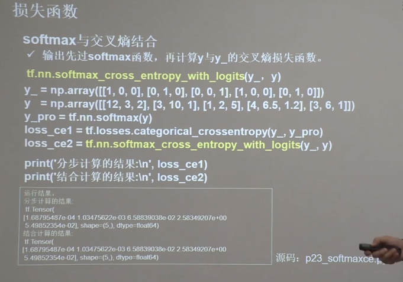

y_pro.....和loss_ce1....两步等同于loss_ce2.....

# lecture2.5-缓解过拟合

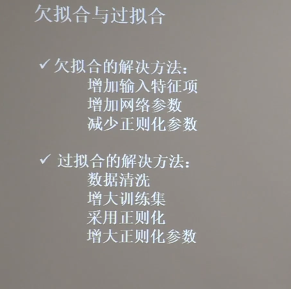

## 正则化

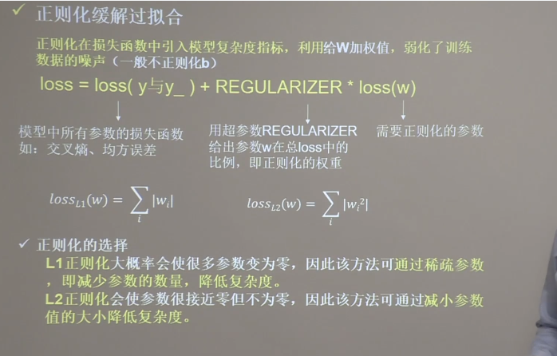

# lecture2.6-优化器

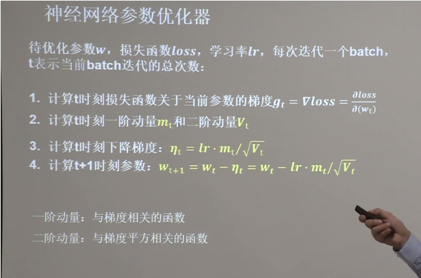

不同的优化器实质上只是定义了不同的一阶动量和二阶动量表达式

## SGD随机梯度下降

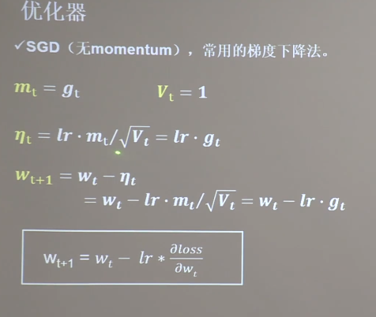

## SGDM

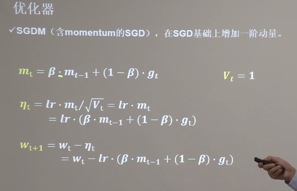

改变了一阶动量mt

## Adagrad

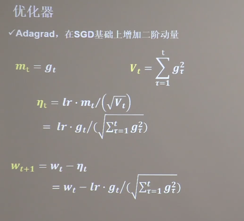

## RMSProp

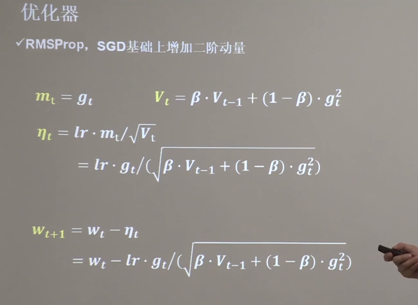

## Adam

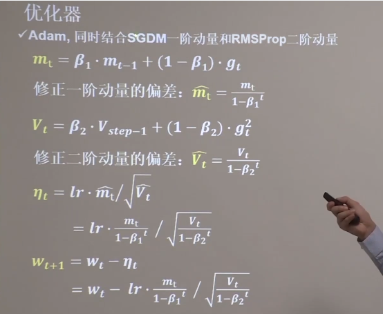

