[TOC]

# lecture3.1-搭建网络八股sequential

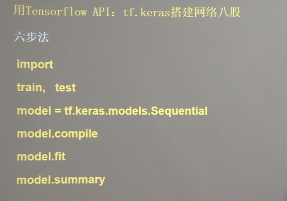

Sequential：逐层描述网络，前向传播

compile：配置训练方法，优化器、损失函数、评测指标

fit：执行训练过程，告知训练集和测试集的输入特征和标签，batch、epoch的大小、

summary：打印网络结构和参数统计

## train test

两种方式：

- 手动划分训练集和测试集
-  在fit（）中使用比例参数划分，如`validation_split=0.2`

## Sequential-容器

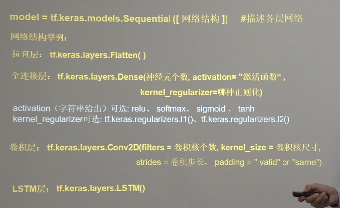

Flatten：输入特征转变为一维数组

## compile

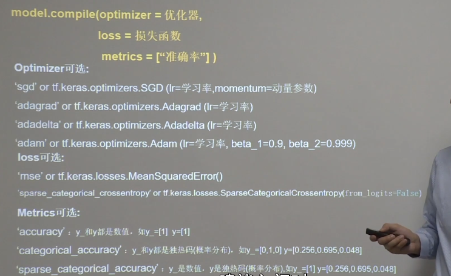

from_logits:表示预测结果是否是经过概率分布（比如softmax）

## fit

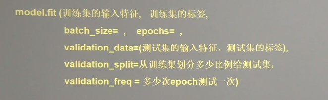

## summary

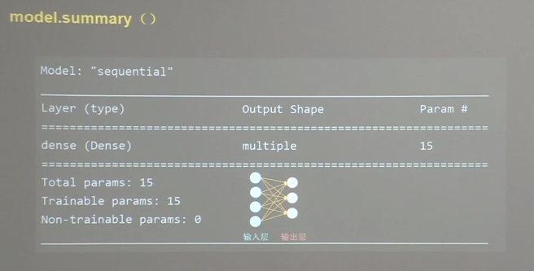

# lecture3.2搭建网络八股class

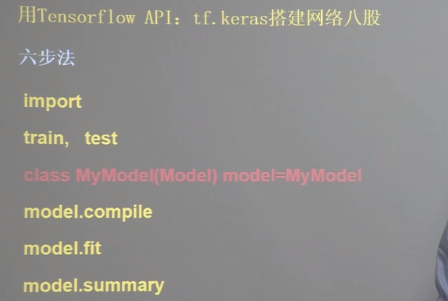

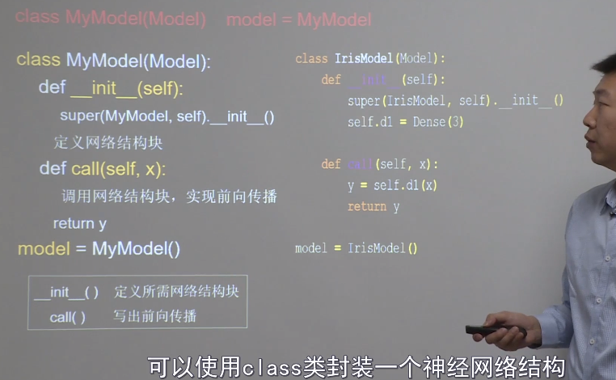

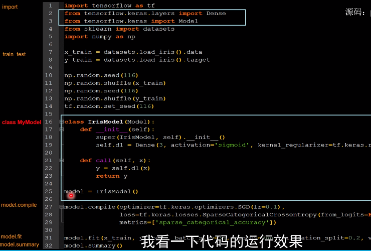

class中必须实现init和call函数，init中定义网络结构，call实现前向传播。

## demo MNIST

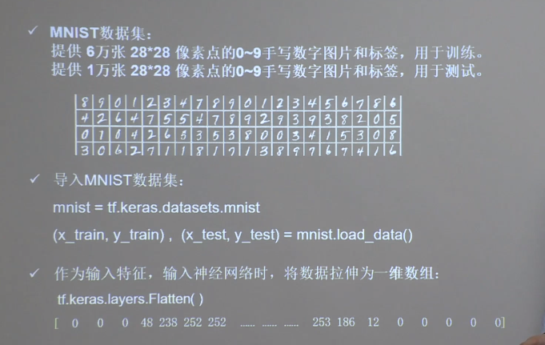

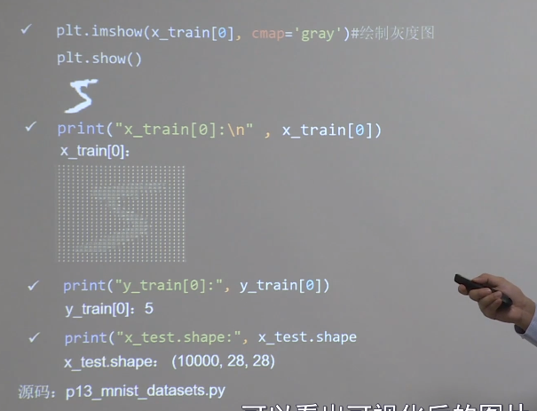

### Sequential实现

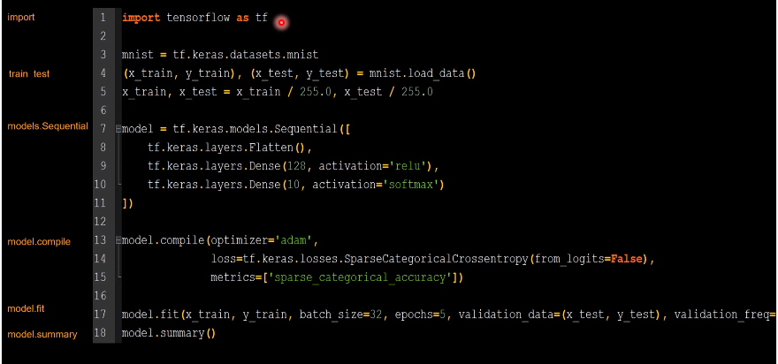

归一化，变为0-1，更有利于神经网络吸收

## class实现

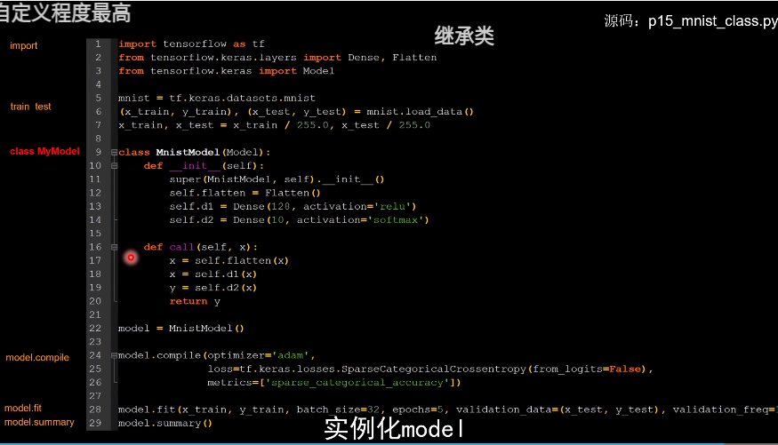