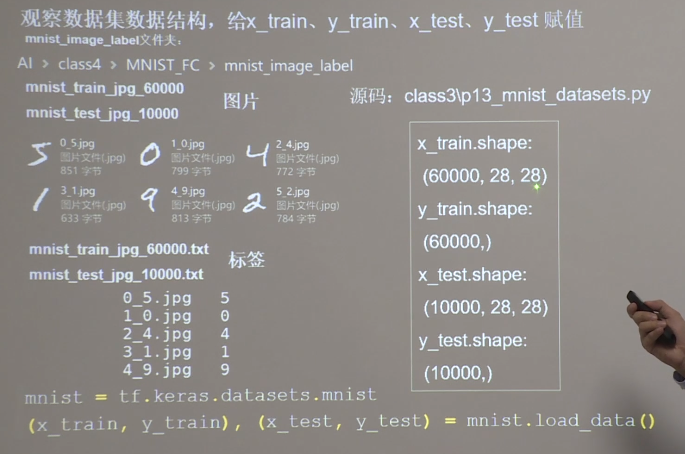
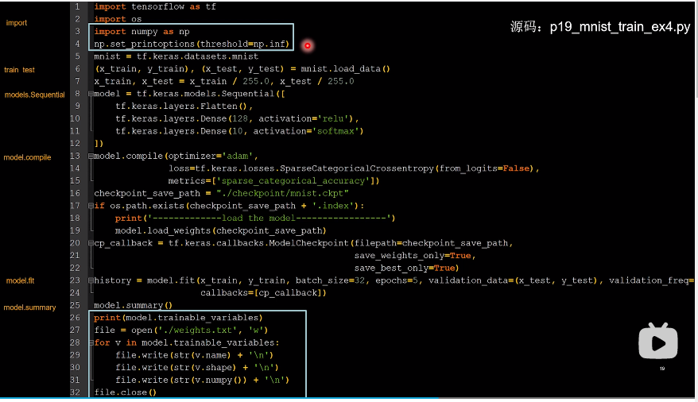

[TOC]

# lecture4.1-搭建网络八股总览

# lecture4.2-自制数据集

from PIL import Image

## 完整代码

# lecture4.3-数据增强

（60000，28，28，1）这个多出来的1，指的是通道数

# lecture4.3-断点续训

xxx.ckpt是模型文件；xxx.index是生成模型时同步生成的索引表

## demo

history可以使下次训练时，接着上次继续训练

# lecture4.5-参数提取

## demo

# lecture4.6-acc/loss可视化

# lecture4.7-给图识物

