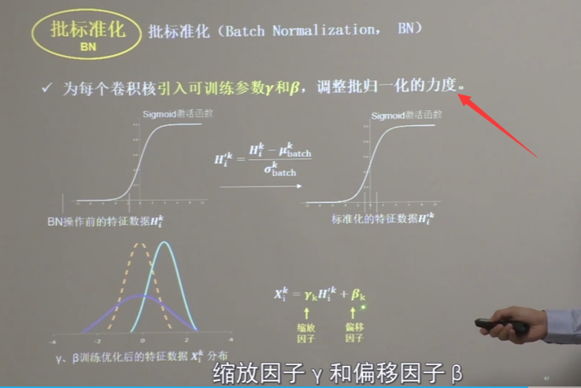

[TOC]

# lecture5 CNN

## lecture5.1-NN计算过程

单通道：

多通道：

多个核求和并加上偏置项

## lecture5.2-感受野

### 感受野定义

即卷积核滑动后产生的大小

### 怎么选

考虑待训练参数量和计算量（相乘的次数）

## lecture5.3-全零填充

卷积后保持输入特征图的尺寸不变

### 尺寸计算公式

## lecture5.4-TF描述卷积计算层

## lecture5.5-批标准化

神经网络对0附近的数据更敏感，但是网络层数的增加，会使特征数据出现偏离0均值的情况。**缓解梯度消失**。

**标准化**：数据符合0为均值，1为标准差的标准正太分布

**批标准化（batch normalization BN）：**对一小批数据（batch），做标准化。**常用在卷积操作和激活操作之间**

### 公式

X = （原值-μ）/  标准差σ

μ和σ是一个batch集体算的

### 可训练参数：缩放因子、偏移因子

集中在激活函数中心的线性区域，使激活函数丧失了非线性特性。

缩放因子、偏移因子：调整数据分布的宽窄和偏移量，保证网络非线性表达能力

### 实现

## lecture5.6-池化

### 实现

## lecture5.7-舍弃

缓解神经网络过拟合

## lecture5.8-卷积神经网络

