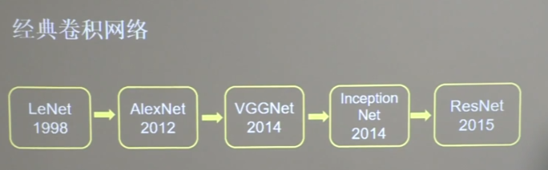
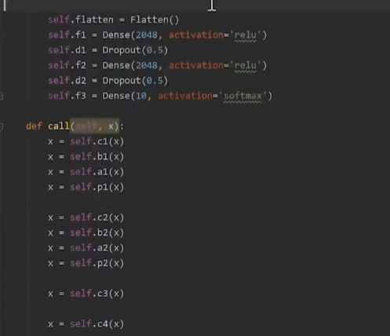
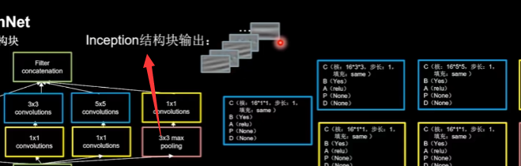
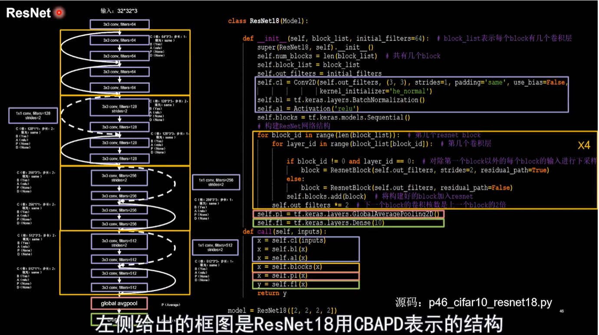

[TOC]

# 经典卷积网络

## lecture5.11-LeNet

## lecture5.12-AlexNet

使用ReLu，提升训练速度

使用Dropout，缓解过拟合

## lecture5.13-VGGNet

使用小尺寸卷积核，减少参数的同时，提高了识别率；

VGGNet结构规整，适合硬件加速

VGG16：

通过增加卷积核的个数，增加了特征图的深度，保持了信息的承载能力

## lecture5.14-InceptionNet

该net引入了Inception结构块

在同一层网络内使用了不同尺寸的卷积核，提到很累提升了模型感知力

使用了批标准化（BN），缓解了梯度消失

使用n（n小于输入深度）个1x1的卷积核，达到降维的作用，即通道维度变了

### inception结构快

c1:第一个分支

c2_：第二个分支，使用两次

### 精简版-10层

## lecture5.15-ResNet

### 总结

